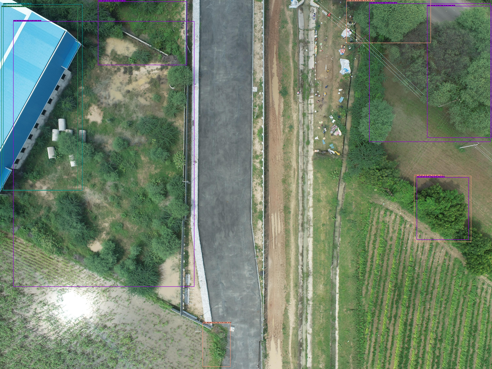
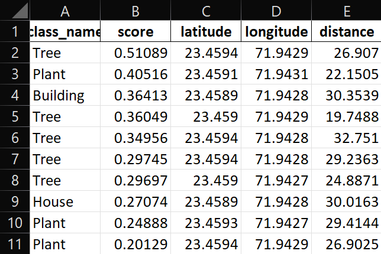
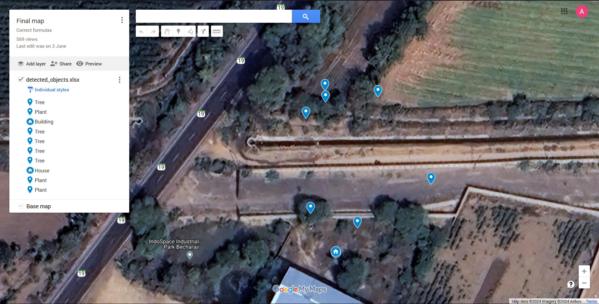
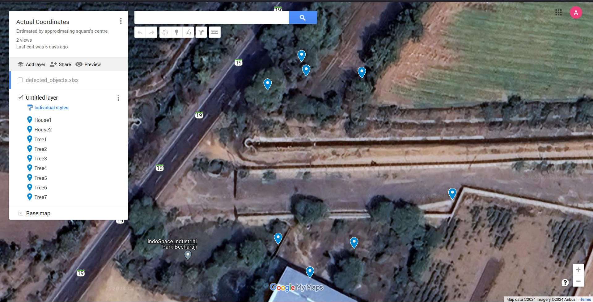

# 📸 UAV Object and Geolocation Documentation

## Overview

This document provides an in-depth look at the UAV Object Geolocation project. It covers the models used, the calculation methods, step-by-step examples, and additional information on EXIF data extraction and assumptions.


## Project Structure

```
├── src/
│ ├── init.py # Init file for the src module
│ ├── main.py # Main script for running the object detection and geolocation extraction
│ └── utils.py # Utility functions for image processing, geolocation extraction, and file saving
├── data/
│ └── input_image.jpg # Example input image
├── output/
│ ├── annotated_image.jpg # Annotated output image (generated)
│ └── detected_objects.xlsx # Excel file with detected objects' details (generated)
├── docs/
│ └── documentation.md # Detailed project documentation
└── object_detection_demo.ipynb # Jupyter Notebook for running the demo
```


## Model and Methods

The UAV Object Geolocation project uses an object detection model to identify objects in UAV images and extract their geolocation data based on the image's EXIF metadata. The following sections provide details on the model used, the geolocation calculation methods, and a step-by-step example of the process.


### Object Detection Model

We use the Faster R-CNN Inception ResNet V2 model from TensorFlow Hub:
- **Model URL**: [Faster R-CNN Inception ResNet V2](https://tfhub.dev/google/faster_rcnn/openimages_v4/inception_resnet_v2/1)
- **Why this model?**: This model is chosen for its accuracy and performance in object detection tasks. It leverages the strengths of both Faster R-CNN and Inception ResNet architectures. More importantly, it is just a placeholder for the current implementation. A custom model trained on specific UAV images would be more suitable for this task.


### Geolocation Calculation

The geolocation of detected objects is determined using the following steps:

1. **Extract EXIF Data**: We use ExifTool to extract metadata from the image, including relative altitude, field of view, camera yaw, and GPS coordinates.

2. **Convert Field of View**: Convert the field of view from degrees to radians for calculation purposes.

3. **Calculate Ground Distance**: Use the relative altitude and field of view to calculate the ground distance depicted in the image.

4. **Determine Bearing**: Calculate the bearing of the object relative to the drone's orientation.

5. **Normalize Coordinates**: Convert image coordinates to a normalized system centered on the drone.

6. **Calculate Distance and Angle**: Determine the distance and angle of the object from the center point.

7. **Geolocation Calculation**: Use rhumb line formulas to calculate the geographic coordinates (latitude and longitude) of the detected object.


### Step-by-Step Example

1. **Input Image**: An image taken by a UAV, saved in the `data` directory.

2. **Run Detection**:
    ```bash
    python src/main.py
    ```

3. **Extracted Data**: EXIF data is extracted, and object coordinates are calculated.

4. **Annotated Image**: The output image with bounding boxes is saved in the `output` directory.

5. **Detected Objects**: The details of detected objects, including their geolocation, are saved to an Excel file in the `output` directory.


### Results


*Figure: Example input image taken by a UAV.*

Type `exiftool data/input_image.jpg` in the terminal to view the image's metadata using ExifTool. For more details. 

You can also try using the online tool [ExifMeta](https://exifmeta.com) to view the metadata of the image.



*Figure: Example of an annotated image with detected objects and geolocation data.*


  
*Figure: Example of the Excel file with detected objects and their geolocation details.*

You can view the detected objects in the Excel file and plot them on a map using tools like Google Earth or QGIS.



*Figure: Example of the calculated coordinates for detected objects. [Google My Maps](https://www.google.com/maps/d/u/0/edit?mid=1TB8ha26nWzqllJywshH8QHF0KTdYDN4&usp=sharing)*



*Figure: Estimated coordinates for detected objects based on geometric calculations from annotated image for comparison. [Google My Maps](https://www.google.com/maps/d/u/0/edit?mid=11ve4y7Siup8H51KHt2dJ4nyMhQzoO7U&usp=sharing)*


By calculating the difference between the estimated and calculated coordinates, we achieve an average error of **10.71** meters for the detected objects. 

## Setup Instructions

1. **Ensure ExifTool is installed**:
    ```sh
    sudo apt-get install exiftool
    ```

2. **Clone the repository**:
    ```sh
    git clone https://github.com/ayush4ise/uav-object-geolocation.git
    cd uav-object-geolocation
    ```

3. **Create and activate a virtual environment**:
    ```sh
    python -m venv venv
    source venv/bin/activate  # On Windows: venv\Scripts\activate
    ```

4. **Install the dependencies**:
    ```sh
    pip install -r requirements.txt
    ```

## Running the Project

### Jupyter Notebook

1. **Start Jupyter Notebook**:
    ```sh
    jupyter notebook
    ```

3. **Open `demo_notebook.ipynb` and run the cells**.

### Main Script

1. **Run the main script**:
    ```sh
    python src/main.py
    ```

For any further details, please refer to the specific functions and classes in the codebase.


## Dependencies


### Libraries Used
- **TensorFlow**: For loading and running the object detection model.
- **TensorFlow Hub**: For accessing pre-trained models.
- **PIL (Pillow)**: For image processing.
- **ExifTool**: For extracting EXIF metadata.
- **Pandas**: For saving results to an Excel file.

### Software Requirements
- **Python 3.6+**
- **ExifTool**: For extracting metadata from images.


## Assumptions and Limitations

- The camera's relative altitude is provided in feet and is converted to meters.
- The field of view is assumed to be horizontally measured.
- The drone's yaw is accurately provided in the EXIF data.
- The images are geotagged with GPS coordinates.
- Only JPG images are used for geolocation extraction.
- The `output` directory exists and is writable.


## Future Work

- Enhance object detection accuracy with a custom-trained model for UAV images.
- Incorporate more sophisticated geolocation algorithms.
- Add support for different image formats and metadata standards.
- Handle cases where EXIF data is missing or incomplete.
- Develop a user-friendly interface for running the tool.


## References

- [TensorFlow Hub](https://tfhub.dev/)
- [ExifTool](https://exiftool.org/)
- [PyExifTool Documentation](https://smarnach.github.io/pyexiftool/)
- [Pandas Documentation](https://pandas.pydata.org/docs/)
- [Rhumb Line Formula](https://en.wikipedia.org/wiki/Rhumb_line)

Github repositories taken as reference:
- [DJI Aerial Georeferencing](https://github.com/roboflow/dji-aerial-georeferencing)
- [pyturf](https://github.com/pyturf/pyturf)